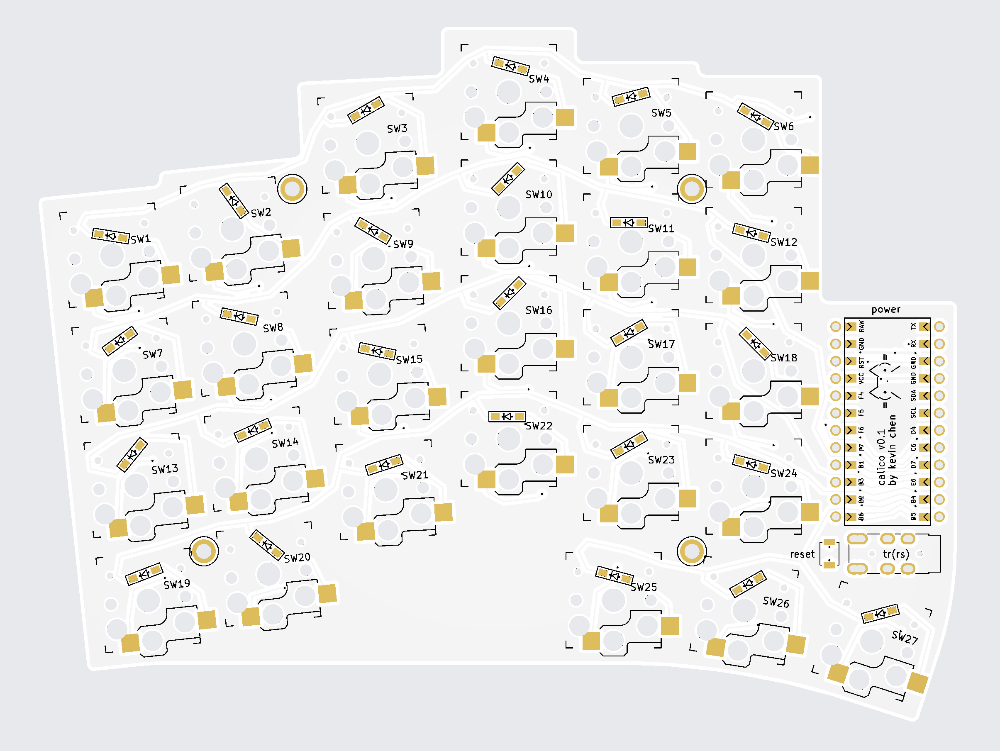
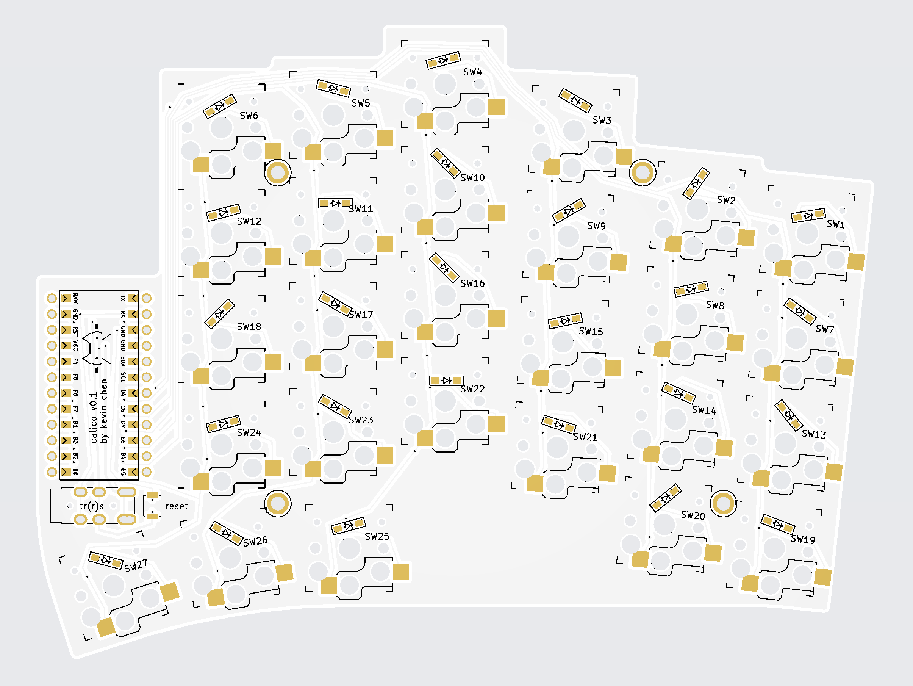
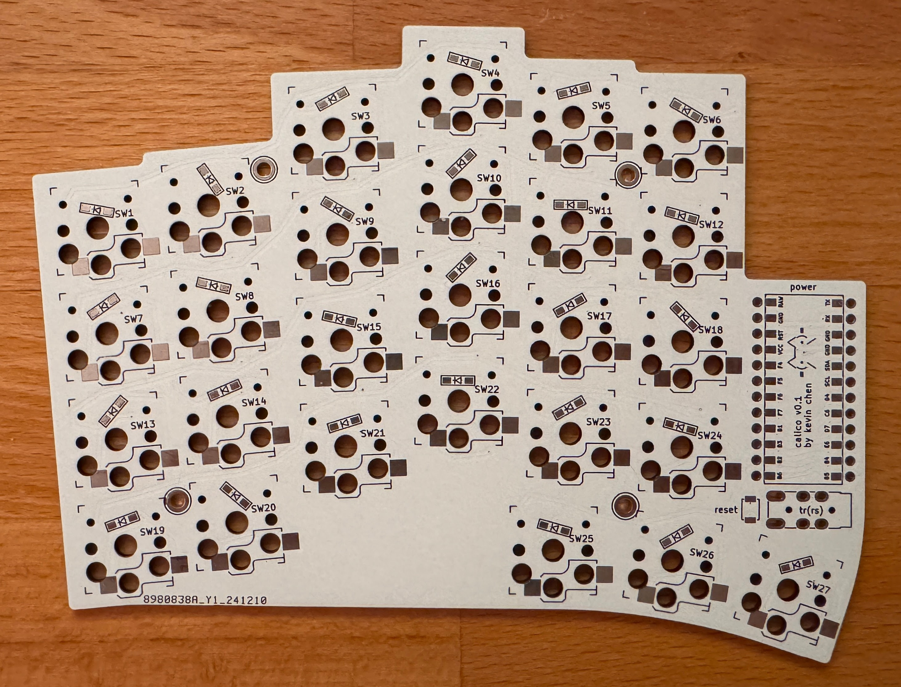

# calico

calico is a 54 key (6x4+3 split) column-staggered choc-spaced split ergonomic keyboard with freehanded traces and diode sprinkles

* promicro based
* reversible
* hotswap only, for now

### v0.2

changes
* bring trrs jack all the way to the edge
* bring pro micro down a bit, close gap with trrs
* modify footprints for reset, trrs
* use different footprint for the pro micro

### v0.1

### calico was inspired by

* [Lily58 by kata0510](https://github.com/kata0510/Lily58)
* [Peter Blasser's Ciat-Lonbarde PCBs](https://www.ciat-lonbarde.net/)
* [bugs by jimmerricks](https://github.com/jimmerricks/bugs)
* [Swoop MX by jimmerricks](https://github.com/jimmerricks/swoop)
* [Sweep Half Swept by David Barr](https://github.com/davidphilipbarr/Sweep)
* [keyboards by mindhatch](https://github.com/mindhatch/keyboards)
* [Sofle by Joseph Adamčík](https://josefadamcik.github.io/SofleKeyboard/)
* [TOTEM by GEIGEIGEIST](https://github.com/GEIGEIGEIST/TOTEM)

### and also thanks to

* [ergogen](https://github.com/ergogen/ergogen)
* [kicad-kbplacer](https://github.com/adamws/kicad-kbplacer/tree/master)
