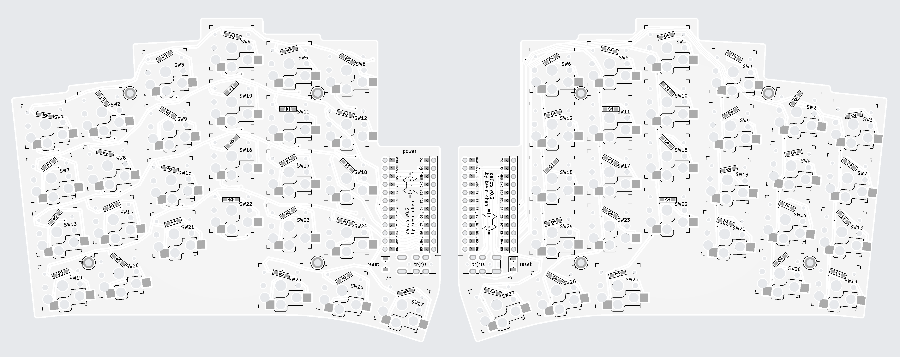

# calico

calico is a 54 key (6x4+3 split) column-staggered choc-spaced split ergonomic keyboard with freehanded traces and diode sprinkles

* pro micro based
* reversible pcb
* choc v1 hotswap only

## board

### v0.2

changes from v0.1

* brought trrs jack all the way to the edge
* brought pro micro down a bit, close gap with trrs
* modify footprints for reset and trrs
* use different footprint for the pro micro

## to build calico, you'll need:

* 2x calico v0.2 pcbs
* 2x pro micro compatible boards
* 54x choc v1 switches
* 54x choc 1u keycaps (I used MBK profile)
* 54x Kailh choc hotswap sockets
* 54x SOD-123 diodes (I used 1N4148W)
* 2x TRRS PJ-320A jacks
* 1x TRRS cable
* 2x tact switch (optional, just carry a paperclip)
* at least 8x rubber feet (I used 10)
* 1x usb-c cable

I'd also recommend socketing your pro micros:

* 4x BBL-112-T-E Samtec ([mouser](https://www.mouser.com/ProductDetail/Samtec/BBL-112-T-E?qs=FESYatJ8odKicQFiFw2tKA%3D%3D), [digikey](https://www.digikey.com/en/products/detail/samtec-inc/BBL-112-T-E/1099406))
* 4x 315-43-112-41-003000 Mill-Max ([mouser](https://www.mouser.com/ProductDetail/Mill-Max/315-43-112-41-003000?qs=s8Nb1z4Wn%2FRfWrVqQ0TOuQ%3D%3D), [digikey](https://www.digikey.com/en/products/detail/mill-max-manufacturing-corp/315-43-112-41-003000/4455232))

## calico was inspired by

* [Lily58 by kata0510](https://github.com/kata0510/Lily58)
* [Peter Blasser's Ciat-Lonbarde PCBs](https://www.ciat-lonbarde.net/)
* [bugs by jimmerricks](https://github.com/jimmerricks/bugs)
* [Swoop MX by jimmerricks](https://github.com/jimmerricks/swoop)
* [Sweep Half Swept by David Barr](https://github.com/davidphilipbarr/Sweep)
* [keyboards by mindhatch](https://github.com/mindhatch/keyboards)
* [Sofle by Joseph Adamčík](https://josefadamcik.github.io/SofleKeyboard/)
* [TOTEM by GEIGEIGEIST](https://github.com/GEIGEIGEIST/TOTEM)

### and designed with the use of

* [ergogen](https://github.com/ergogen/ergogen)
* [kicad-kbplacer](https://github.com/adamws/kicad-kbplacer/tree/master)
